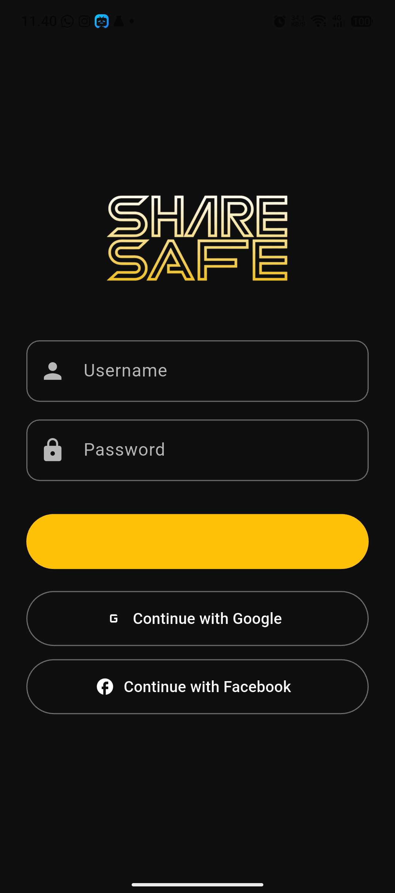
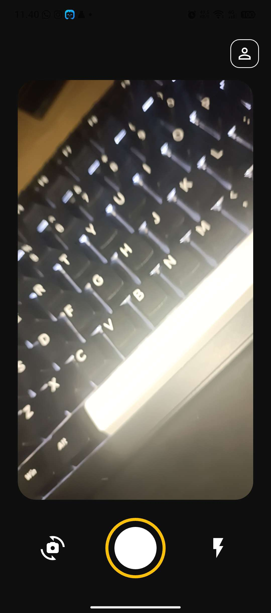
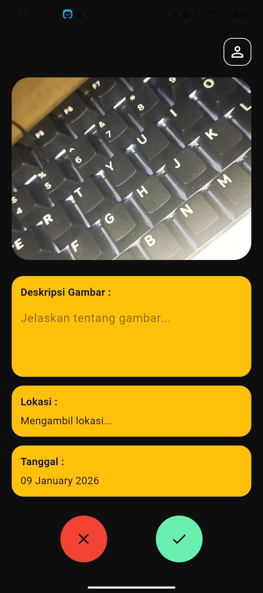
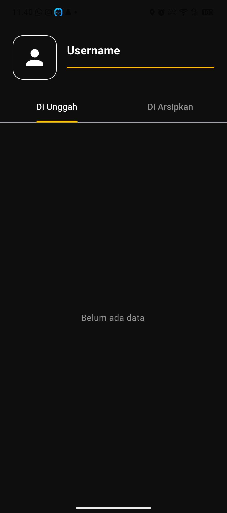

# 🔐 ShareSafe

ShareSafe adalah aplikasi mobile berbasis **Flutter** yang memungkinkan pengguna untuk mengunggah dan menyimpan foto secara aman. Setiap unggahan dilengkapi dengan deskripsi, lokasi, dan tanggal, serta terhubung langsung dengan akun pengguna. Aplikasi ini menggunakan **Firebase** sebagai backend untuk autentikasi dan penyimpanan data secara real-time.

## ✨ Fitur Utama
- 📸 Upload foto dengan deskripsi
- 📍 Menyimpan lokasi dan tanggal unggahan
- 👤 Profil pengguna dengan riwayat unggahan
- 🔐 Autentikasi pengguna
- ☁️ Penyimpanan cloud menggunakan Firebase
- ⚡ Real-time data update

## 🛠 Teknologi yang Digunakan
- **Flutter**
- **Firebase Authentication**
- **Cloud Firestore**
- **Firebase Storage**
- **Geolocation**

## Screenshoot

## Rancangan Arsitektur Sistem

## Link Figma
https://www.figma.com/design/00cZP3z6xMy6Naqo2HGRuQ/UAS-PM?node-id=0-1&t=X1eBbDWvDT6QZKhe-1

📄 Lisensi
